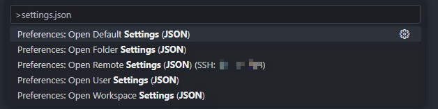
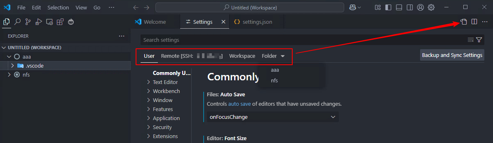
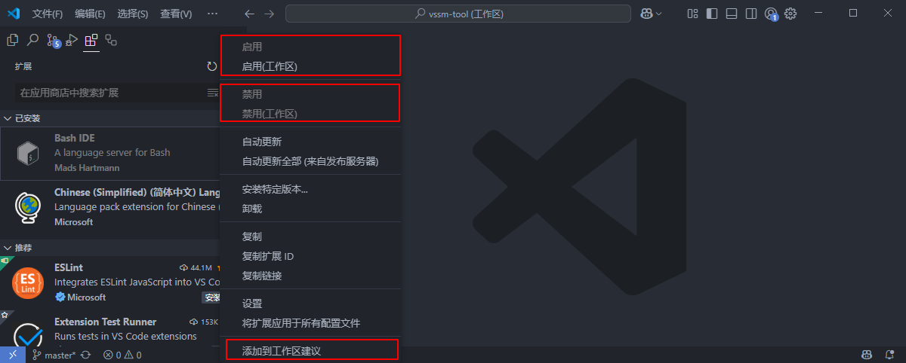

# 一、苏木的 vssm-tool 扩展小工具

[](https://nodejs.org/dist/v22.16.0/node-v22.16.0-win-x64.zip)&nbsp;&nbsp;&nbsp;&nbsp;[](https://badgen.net/static/npm/10.9.2/F96854)&nbsp;&nbsp;&nbsp;&nbsp;[](https://github.com/pnpm/pnpm)&nbsp;&nbsp;&nbsp;&nbsp;[](https://code.visualstudio.com/)

[](https://sumumm.github.io/)&nbsp;&nbsp;&nbsp;&nbsp;[](https://github.com/sumumm)&nbsp;&nbsp;&nbsp;&nbsp;[](https://www.npmjs.com/~sumumm)

[](https://marketplace.visualstudio.com/publishers/ms-vs-extensions)&nbsp;&nbsp;&nbsp;&nbsp;[](https://marketplace.visualstudio.com/manage/publishers/ms-vs-extensions)


[](https://docs-site.github.io/site-docsify/)&nbsp;&nbsp;&nbsp;&nbsp;[](https://vscode.js.cn/docs)&nbsp;&nbsp;&nbsp;&nbsp;[](https://code.visualstudio.com/docs)&nbsp;&nbsp;&nbsp;&nbsp;[](https://liiked.github.io/VS-Code-Extension-Doc-ZH/)

# 二、vscode配置

## 1. 哪些设置？

vscode配置的层次关系：

```txt
系统默认设置(不可修改) - 用户设置 - 远程设置 - 工作区设置 - 文件夹设置
```

后者的设置会覆盖前者的设置，若没有设置某一项，将继续使用前者的设置。一共就是有这五种配置文件：



我们在【vscode】&rarr;【设置面板】最多可以看到这些类型设置：



## 2. 设置说明

- 默认设置：VS Code的默认值不可编辑修改，当没有提供其它设置的值时候或者提供的是无效值的时候，VS Code提供的默认设置生效；
- 用户设置：一般是`%APPDATA%/Code/User/settings.json`，此设置对所有项目生效，如果提供了有效设置会覆盖比它权重低的设置；
- 远程设置：一般是`~/.vscode-server/data/Machine/settings.json`，如果使用了VS Code的远程开发功能将会显示此Tab，此设置对该远程机器生效，如果提供了有效设置会覆盖比它权重低的设置；
- 工作区设置：一般是`*.code-workspace.settings`或者`%APPDATA%/Code/Workspaces/xxx/workspace.json`，默认情况下每打开一个文件夹就是一个工作区，如果提供了有效设置会覆盖比它权重低的设置；
- 文件夹设置：`.vscode/settings.json`，如果启用了多根工作区就会展示此设置，可以为工作区下面的每个文件夹添加独立设置，如果提供了有效设置会覆盖比它权重低的设置，这个设置也是权限最高的设置因为就在当前文件夹下。

## 3. 工作区设置和文件夹设置

关于工作区设置和文件夹设置，还有不同的情况：

（1）工作区文件不存在，并且这个工作区中只有一个文件夹时，我们打开的工作区设置其实就是文件夹设置，会打开`.vscode/settings.json`。

（2）工作区文件不存在，并且这个工作区有多个文件夹时，每个文件夹都可以有自己的文件夹设置，都可以有一个`.vscode/settings.json`，这个时候，工作区设置是`%APPDATA%/Code/Workspaces/xxx/workspace.json`。这个xxx是一个临时目录，当vscode关闭时若是没保存工作区，这个目录自动删除。

（3）工作区文件存在，这个工作区不管有几个文件夹，工作区设置就是`*.code-workspace.settings`，文件夹设置就是各个文件夹下的`.vscode/settings.json`。

（4）工作区文件存在，工作区只有一个文件夹，但是没有打开工作区，这个时候工作区设置其实也就是文件夹设置，也会打开`.vscode/settings.json`。

## 4. 扩展禁用

我们可以为每个工作区设置自己的扩展，我们安装完扩展，扩展右边会有一个设置图标，里面会有这几项配置：



- 选项“启用/禁用”为我们的用户设置
- 选项“启用/禁用（工作区）”为工作区设置
- 添加到工作区建议（可以添加到工作区文件夹，也可以添加到整个工作区文件中）

> Tips：在工作区中启用和禁用的插件由VS Code 内部保存相关状态，并不会保存在VS Code的工作区设置文件中，所以目前并不能共享，这点和 **工作区建议** 是不同的。**工作区建议**是存储在工作区的设置中，是可以共享的。

此设置会只应用到当前工作区下，不会影响用户设置和其他工作区的设置，文件夹无此设置。建议在用户设置（即非打开工作区的情况下）关闭大多数插件，留下常用的，在不同的工作区下再开启，这样可以避免vscode过多造成卡顿。

# 三、小徽章

>- [badgen.net](https://badgen.net/)
>- [Shields.io | Shields.io](https://shields.io/)
>- [For the Badge](https://forthebadge.com/)
